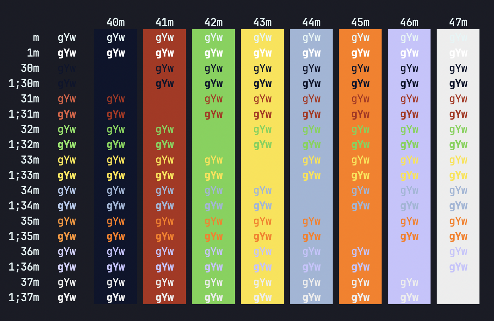
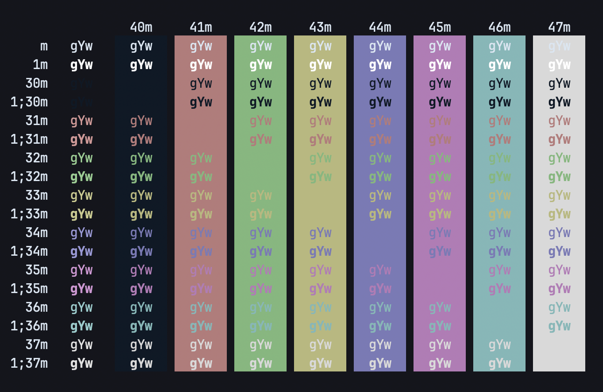
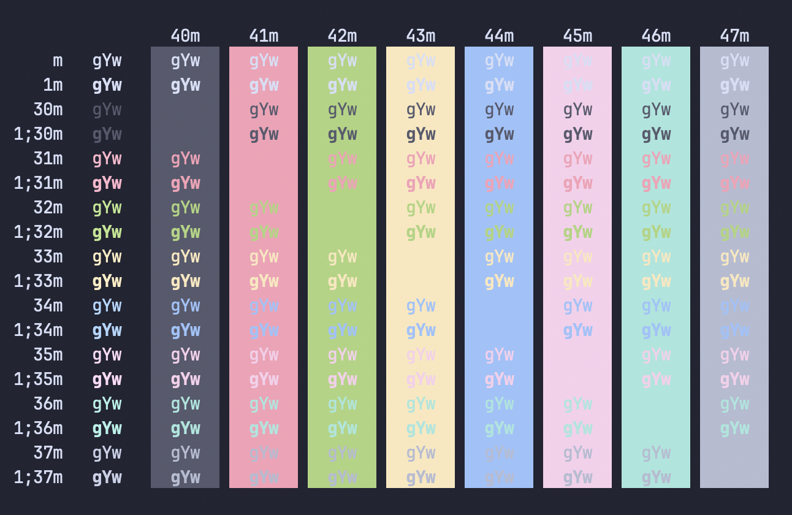

# macOS Terminal Colors
Dark terminal themes and color schemes for macOS default Terminal.app! Originally, these themes are exported to take away the pain of tweaking popular themes for my preference.

## Quick Start

You can also download themes from [Terminal Colors](https://terminalcolors.com/tags/dark/) and [macOS Terminal Themes](https://github.com/lysyi3m/macos-terminal-themes) by following these repetitive steps:

1. First, download the `.terminal` color scheme.
2. Next, import into the Terminal.app via Settings > Profiles > Import (left pane).
3. Mark it Default profile.

Spin up a new Terminal window to see the theme in action.

## Fonts

You are better off using Nerd Fonts, since the typeface designed for developers and the likeminded people who spend time on the terminal.

1. Download from the Nerd Fonts site and install, otherwise;

- ```bash
  brew search '/font-jetbrains.*-nerd-font/' | awk '{ print $1 }' | xargs brew install
  ```


2. Then, select the imported Profile in the Settings > Profiles > Text tab.
3. Change the current font and size to the downloaded Nerd Font.

Restart the Terminal.app or spin up a new window to see the font changes.

## Themes and color schemes

### Blackboarded

  

Inspired by the *Blackboard* theme in the [carbon.sh](https://carbon.now.sh/?bg=rgba%280%2C0%2C0%2C1%29&t=blackboard&wt=none&l=application%2Fx-sh&width=680&ds=true&dsyoff=20px&dsblur=68px&wc=true&wa=true&pv=56px&ph=56px&ln=false&fl=1&fm=Hack&fs=14px&lh=133%25&si=false&es=2x&wm=false) site. Original theme and colors scheme from [@pantulis/blackboard-terminal](https://github.com/pantulis/blackboard-terminal).

### Blazered

  

Original *Blazer* theme and colors scheme from [@lysyi3m/macos-terminal-themes](https://github.com/lysyi3m/macos-terminal-themes?tab=readme-ov-file#blazer-download) repo.

### Catppuccined

  

Original *Catppuccin* theme and colors scheme variant *Mocha* was downloaded from [terminalcolors.com](https://terminalcolors.com/themes/catppuccin/mocha/) site.

### Tokyo Nighted

  

Original *Tokyo Night* theme was downloaded from [terminalcolors.com](https://terminalcolors.com/themes/tokyo-night/default/) site.

## Credit

Many of the customizations taken from:

- [terminalcolors.com](https://terminalcolors.com/tags/dark/)
- [@lysyi3m/macos-terminal-themes](https://github.com/lysyi3m/macos-terminal-themes), and
- [@pantulis/blackboard-terminal](https://github.com/pantulis/blackboard-terminal)

## License

Copyright (c) 2025 It's actually me (@kosperera). All rights reserved.

The content is licensed under [MIT license](#MIT-1-ov-file).
